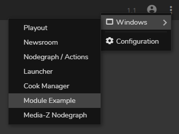

# RealityHub Module Example

You can write your own module and integrate it with RealityHub. This custom module has its own backend and frontend code. 

The backend code can run on any machine; it doesn't have to be on the same machine as RealityHub. 

For the frontend code, RealityHub will act as an HTTP proxy server between the browser and your HTTP server. RealityHub
will try to load your `/index.js` file in `index.html`. Then your `index.js` can download all other resources via [Fetch API](https://developer.mozilla.org/en-US/docs/Web/API/Fetch_API) or [XMLHttpRequest](https://developer.mozilla.org/en-US/docs/Web/API/XMLHttpRequest)
(or any other method) and append the resources to the DOM.

## Installation

To install project dependencies:

```bash
npm install
```

To run the server:

```bash
npm start
```

Now Module Example will be listed under the Windows menu in RealityHub.



To run the server in development mode (will automatically restart when there is a change in the backend code):

```bash
npm run dev
```

### Troubleshooting

Module Example has to communicate with RealityHub. It assumes that RealityHub is running on the same machine (you can change the server code if that's not the case). By default, RealityHub will listen to port 80. However, if you've changed this port during RealityHub installation then you should also provide the same port information to Module Example. Otherise Module Example won't be able to connect to RealityHub. To set the port:

```bash
set REALITY_HUB_PORT=3000
```

Then restart the Module server.

## Reality Properties

RealityHub provides many form inputs as Web Components. You can use them in your designs.

### Creating a Reality Property

```html
<reality-property Type="Vector2D" id="vector2d"></reality-property>
```


### Setting a value

```js
const realityProperty = document.getElementById('vector2d');
realityProperty.value = {
  X: 120,
  Y: 150,
};
```

### Subscribing to changes

If you want to listen to the changes as they are happening:

```js
// Will emit multiple events while the user is changing the value using a mouse.
realityProperty.addEventListener('input', () => {
  console.log(realityProperty.value);
});
```

If you want to be notified only once after the changes are happened:

```js
realityProperty.addEventListener('change', () => {
  console.log(realityProperty.value);
});
```

### List of Reality Property Types

* Boolean
* Integer
* Float
* String
* Color
* Vector
* Vector2D
* Rotator
* Size
* Transform
